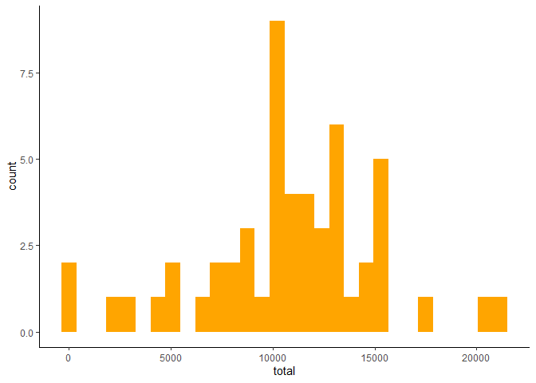
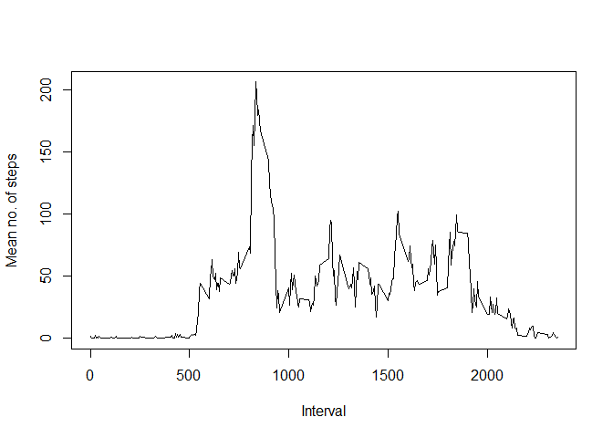
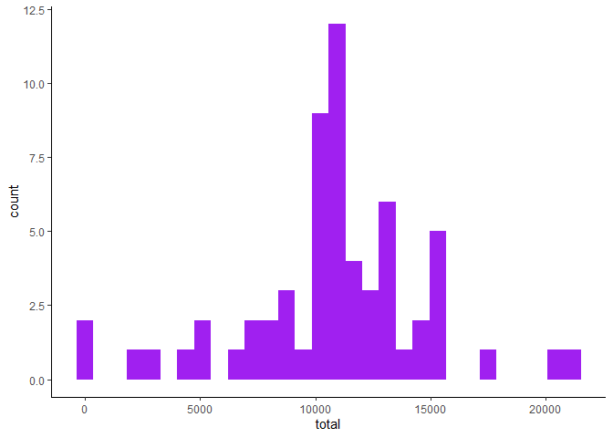
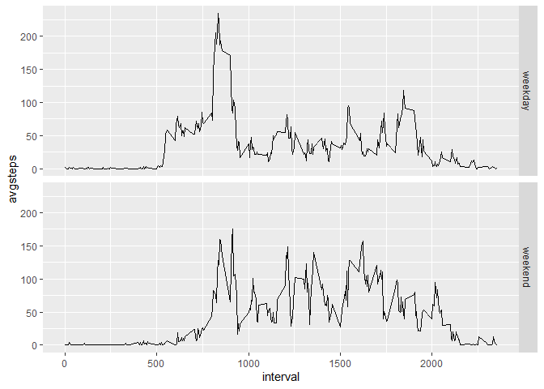

## Loading and preprocessing the data

First, I read in the data, stored in the activity subfolder. 


```r
activity <- read.csv("./activity/activity.csv")
```

Next, I look up the properties of the data:


```r
str(activity)
```

```
## 'data.frame':	17568 obs. of  3 variables:
##  $ steps   : int  NA NA NA NA NA NA NA NA NA NA ...
##  $ date    : Factor w/ 61 levels "2012-10-01","2012-10-02",..: 1 1 1 1 1 1 1 1 1 1 ...
##  $ interval: int  0 5 10 15 20 25 30 35 40 45 ...
```

We notice that `activity$date` is not yet in a date format. Let's convert: 


```r
library(lubridate)
```

```
## 
## Attaching package: 'lubridate'
```

```
## The following object is masked from 'package:base':
## 
##     date
```

```r
activity$date <- as.Date(activity$date, format = "%Y-%m-%d")
```

Now, it should be processable. 

## What is mean total number of steps taken per day?

1. Make a histogram of the total number of steps taken each day

2. Calculate and report the mean and median total number of steps taken per day

I use the `dplyr` package (included in `tidyverse`), and execute the following steps: 
- Filter the NA observations
- Then, group by day
- Afterwards, take total steps (in dplyr language: sum all steps by `date`) on every day
- Write all the previous steps to a data frame

In the last command, I show a histogram of the total number of steps every day. 


```r
library(tidyverse)

question1 <- activity %>%
        na.omit() %>%
        group_by(date) %>%
        summarise(
            total = sum(steps) )

question1 %>%
        ggplot(aes(x = total)) + 
            geom_histogram(fill = "orange") + 
            theme_classic()
```

<!-- -->

```r
mean(question1$total) ; median(question1$total)
```

```
## [1] 10766.19
```

```
## [1] 10765
```

We can see that mean and median steps per day are about equal, 10766.19. That makes sense because the observations are centured around the mean, judging by the histogram. 

## What is the average daily activity pattern?

1. Make a time series plot (i.e. type = "l") of the 5-minute interval (x-axis) and the average number of steps taken, averaged across all days (y-axis)

I use `dplyr` again to average the steps according to interval, and then construct a plot.


```r
question2 <- activity %>%
        na.omit() %>%
        group_by(interval) %>%
        summarise(
            mean = mean(steps)
    )

plot(question2$interval, question2$mean, 
     type = "l", xlab = "Interval", ylab = "Mean no. of steps")
```

<!-- -->

2. Which 5-minute interval, on average across all the days in the dataset, contains the maximum number of steps?


```r
question2[which.max(question2$mean),]
```

```
## # A tibble: 1 x 2
##   interval  mean
##      <int> <dbl>
## 1      835  206.
```

Interval 835. 

## Imputing missing values

1. Calculate and report the total number of missing values in the dataset (i.e. the total number of rows with NAs)


```r
sum(is.na(activity$steps))
```

```
## [1] 2304
```

2. Devise a strategy for filling in all of the missing values in the dataset. The strategy does not need to be sophisticated. For example, you could use the mean/median for that day, or the mean for that 5-minute interval, etc.

3. Create a new dataset that is equal to the original dataset but with the missing data filled in.

Let's make it the mean for that 5-minute interval. The data frame `question2` contains the mean values for each interval. Let's create a new data frame identical to the old one, and then replace the NA entries by the matched entry in the question 2 dataset, and then order to replace them by the means, which are stored in column no. 2!


```r
newactivity <- activity

for (i in 1:nrow(newactivity)) {
                if (is.na(newactivity$steps[i])){
                        newactivity$steps[i] <- question2[match(
                                    newactivity$interval[i],
                                    question2$interval), 2]
        }
}
```

4. Make a histogram of the total number of steps taken each day and Calculate and report the mean and median total number of steps taken per day. Do these values differ from the estimates from the first part of the assignment? What is the impact of imputing missing data on the estimates of the total daily number of steps?


```r
newactivity %>%
    group_by(date) %>%
    summarise(total = sum(as.numeric(steps))) %>%
    ggplot(aes(x = total)) + geom_histogram(fill = "purple") +
    theme_classic()
```

```
## `stat_bin()` using `bins = 30`. Pick better value with `binwidth`.
```

<!-- -->

The histograms look (almost) the same, so the values do not differ from the first part of the assignment, and the impact of imputation is negligible. 

## Are there differences in activity patterns between weekdays and weekends?

1. Create a new factor variable in the dataset with two levels – “weekday” and “weekend” indicating whether a given date is a weekday or weekend day.

I create a vector indicating weekend days. Due to not having English locale on this PC, I use another language (Dutch). Then, I create a factor in the original activity dataset indicating whether the day is a weekday or not by the `ifelse` function. 


```r
weekend <- c("zaterdag","zondag")

activity <- activity %>%
    mutate(day = factor(
        ifelse(weekdays(activity$date) %in% weekend,
               "weekend",
               "weekday") ) 
        )
```

2. Make a panel plot containing a time series plot (i.e. \color{red}{\verb|type = "l"|}type="l") of the 5-minute interval (x-axis) and the average number of steps taken, averaged across all weekday days or weekend days (y-axis). See the README file in the GitHub repository to see an example of what this plot should look like using simulated data.

I omit the NA's, transform the dataframe again, so that I can take the mean per interval per category (weekday or weekend), and then plot the interval (x) against that mean (y), and differentiate between the category of day. 


```r
activity %>%
    na.omit() %>%
    group_by(interval, day) %>%
    summarise(avgsteps = mean(steps)) %>%
        ggplot(aes(interval, avgsteps)) + 
            geom_line() + 
            facet_grid(vars(day))
```

<!-- -->


